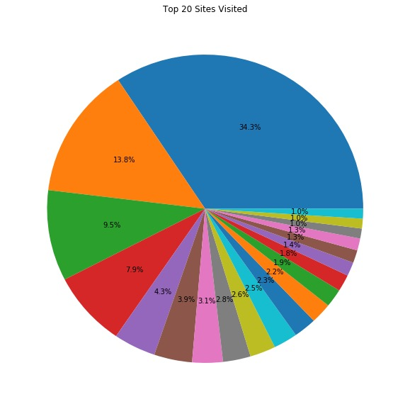

Today, we are going to do some spelunking within the deep, dark place which is your browser history.
In order to obtain the data for this tutorial from Google Chrome, go to
`~/Library/Application Support/Google/Chrome/Default`
on a Mac/Linux computer or `%LocalAppData%\Google\Chrome\User Data\Default` on a Windows PC.
Run the following SQLite command to obtain a text file in reverse chronological order:

On Mac/Linux:

```bash
sqlite3 History "select datetime(last_visit_time/1000000-11644473600,'unixepoch'), url from urls order by last_visit_time desc" > ~/hist.txt
```

Or, on Windows:

```batch
sqlite3 History "select datetime(last_visit_time/1000000-11644473600,'unixepoch'), url from urls order by last_visit_time desc" > %userprofile%\hist.txt
```

Check your user folder. A file called `hist.txt` should be there. Move the file to a suitable place for this exercise.

(This process brought to you by the brilliant people on [Stack Exchange](https://superuser.com/questions/602252/can-chrome-browser-history-be-exported-to-an-html-file)).

Import the needed libraries, `numpy` and `pandas`:

```python
import pandas as pd
import numpy as np
```

## Clean Up Data

That data that we pulled is extremely messy. Here's an example row:

```wiki
2017-11-12 21:10:11|https://news.ycombinator.com/item?id=15678587
```

We need to split on that vertical bar while making sure not to split on a bar in the URL itself.
Since Pandas probably doesn't do this out of the box, let's write a custom import function:


```python
# ...continued from previous code block...
# Open our file
with open('hist.txt') as f:
    content = f.readlines()
# Strip whitespace then split on first occurrence of pipe character
raw_data = [line.split('|', 1) for line in [x.strip() for x in content]]
# We now have a 2D list.
print(raw_data[1])
```

```wiki
['2017-11-12 21:09:21', 'https://news.ycombinator.com/']
```

Using our 2D list, let's make a Pandas DataFrame with custom column headers and make sure it is working:

```python
# ...continued from previous code block...
data = pd.DataFrame(raw_data, columns=['datetime', 'url'])
data.head(1)
```

| &emsp; | datetime            | url                                           |
| ------ | ------------------- | --------------------------------------------- |
| 0      | 2017-11-12 21:10:11 | https://news.ycombinator.com/item?id=15678587 |

Now, we're almost done with ingesting the data. Let's convert the datetime string column into a
column of Pandas `datetime` elements and double-check that it is indeed a Pandas timestamp:

```python
# ...continued from previous code block...
data.datetime = pd.to_datetime(data.datetime)
data.datetime[0]
```

```wiki
Timestamp('2017-11-12 21:10:11')
```

Finally, let's remove all information from the URL, leaving only the domain/subdomain and check our work again:

```python
# ...continued from previous code block...
# Import the urlparse function from the urllib library
from urllib.parse import urlparse
# Define a lambda function to parse the domain from the URL
parser = lambda u: urlparse(u).netloc
# Apply the lambda function to the url column
data.url = data.url.apply(parser)
data.head(1)
```

| &emsp; | datetime            | url                  |
| ------ | ------------------- | -------------------- |
| 0      | 2017-11-12 21:10:11 | news.ycombinator.com |

Finally, our data is clean.

## Analyzing the Data

Now that the boring part is done, let's analyze our browsing data.

### Most Visited Sites

Let's generate a list of our top sites sorted by frequency, then print out the first two to get our most visited sites:

```python
# ...continued from previous code block...
# Aggregate domain entries
site_frequencies = data.url.value_counts().to_frame()
# Make the domain a column
site_frequencies.reset_index(level=0, inplace=True)
# Rename columns to appropriate names
site_frequencies.columns = ['domain', 'count']
# Display top 2
site_frequencies.head(2)
```

| &emsp; | domain         | count |
| ------ | -------------- | ----- |
| 0      | www.google.com | 3904  |
| 1      | github.com     | 1571  |

It should come as no shock that my top sites, just like any other dev, were Google and Github.

_(Is secretly surprised that Stack Overflow was not one of the top ten)_

Now, let's see our top sites in a beautiful chart:

```python
# ...continued from previous code block...
import matplotlib.pyplot as plt
topN = 20
plt.figure(1, figsize=(10,10))
plt.title('Top $n Sites Visited'.replace('$n', str(topN)))
pie_data = site_frequencies['count'].head(topN).tolist()
pie_labels = None
# Uncomment to get specific domain names
# pie_labels = site_frequencies['domain'].head(topN).tolist()
plt.pie(pie_data, autopct='%1.1f%%', labels=pie_labels)
plt.show()
```




What else can we do with the data? A lot, I'm sure, since this is the Holy Grail for ad tracking
companies.
