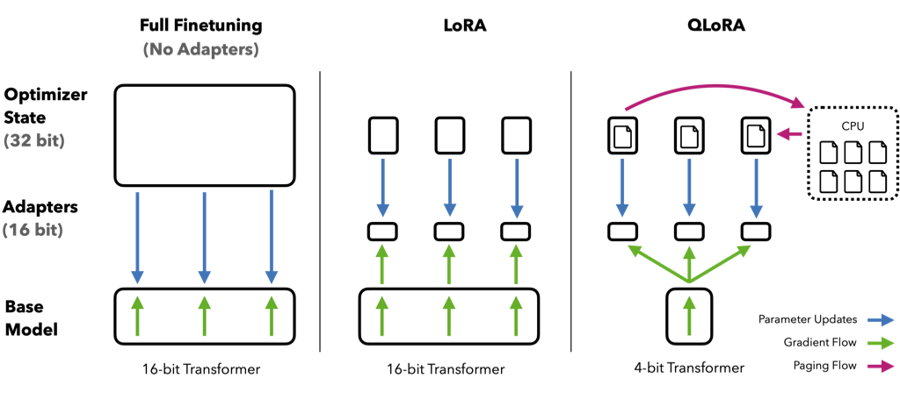
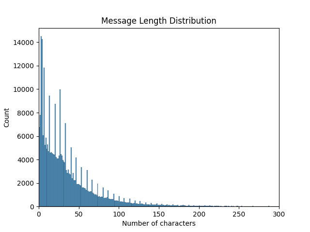

One of the concepts I’ve been mildly interested in recently is the concept of _personal AI_. With large language model output being extremely convincing, startups (such as [Pi](https://pi.ai) and [Friend](https://www.friend.com/)) have begun to promise AI with complex human characteristics like _empathy_ and _companionship_.

Dystopic implications of that aside, rather than focus on emulating complex human emotion, I’m more interested in AI systems that mimic superficial individual behavior in a way that the user can control. For instance, it would be genuinely interesting to interact with a bot version of myself to examine my own diction/syntax as observed by a model.

I set aside a weekend to explore what’s possible with on my hardware with current technology, and while I didn’t end up with profound discoveries of my personality, I ended up with an incredibly entertaining toy for my friends and I to interact with.

## Gathering data

For the purposes of this experiment, I decided to focus on the text modality only, as it’s been widely studied and has proven to be abundantly trainable (thanks to datasets like [CommonCrawl](https://commoncrawl.org/) and [The Pile](https://pile.eleuther.ai/)). But to make a _personal AI_ would require a vast amount of data — on how I write, on what my opinions are, and what my relationship is with the world and others. Sourcing such data would be a unique challenge for me, as I largely shun social media, and don’t have any other bodies of written work large enough (a fancy way of saying I don’t blog very often).

What I did have, however, was a vast body of chat data – both via Discord and iMessage. For me, Discord is a fairly unique app that I adopted over the COVID quarantine, and it allowed me to stay in touch with university clubs, project teams, and friends (and continues to be an important way to keep touch with friends after graduating). Because of my increased reliance on it starting in 2020, I have about 4 years of continuous message data , totaling >291,000 messages (with about half of them in 2020). These millions of text tokens would serve to be a source of truth

While I could use iMessage to complement this data (as this was a de-facto messaging app for everyone else), I doubted that the volume of iMessage data could compare to this trove of text data.

Discord provides users [the ability to export their data](https://support.discord.com/hc/en-us/articles/360004027692-Requesting-a-Copy-of-your-Data), including message data. I requested a data dump, and within a day, I had a ZIP file containing the content of my messages and analytics data. Each folder is labeled with a channel ID containing a `messages.json` file with an array of messages. Each individual message object looks something like this:

```jsx
{
	"ID": 1111111111111111111,
	"Timestamp": "YYYY-MM-DD HH:MM:SS",
	"Contents": "<some text>",
	"Attachments": ""
}
```

### Turning Discord messages into LLM training data

Fine-tuning a model on free text usually requires processing each document/training example into a JSONL file, which is a line-delimited array of JSON objects.

```jsx
{"text": "this is document A"}
{"text": "this is document B"}
```

This was really simple to do on all `messages.json` files with a shell one-liner:

```bash
for file in ./training_data/**/messages.json; do
		new_filename=$(echo "$file" | sed 's/.json/.jsonl/g')
    jq -c '.[]' "$file" > "$new_filename"
done
```

After which, this was perfect to load into a [Polars](https://pola.rs/) DataFrame for randomization and train/validation splitting (which I’m not going to go into here, but it’s documented in my Github repo scripts).

## Picking a model and prepping data

To avoid the painful (and long) effort of having to train a model to understand and produce language from scratch, I decided to pick an off-the-shelf model to fine-tune to my use case.

Fine-tuning allows me to change the weights of the language model (i.e. directly influence the output patterns), which is exactly what I need if I’m training a bot to act like me. While techniques like [RAG](https://aws.amazon.com/what-is/retrieval-augmented-generation/) help these models produce factual information where those aspects are important, my understanding is that they wouldn’t directly have influence over the actual style of output of the model.

Browsing the [HuggingFace list of text generation models](https://huggingface.co/models?pipeline_tag=text-generation&sort=likes), I somewhat arbitrarily narrowed the list down to three models: [Phi-3 Mini](https://huggingface.co/microsoft/Phi-3-mini-128k-instruct), [Llama 3.1 8B](https://huggingface.co/meta-llama/Meta-Llama-3.1-8B), and [Mistral 0.3 7B](https://huggingface.co/mistralai/Mistral-7B-v0.3). I ended up ruling out Llama due to the licensing requirements specifically requiring a full name and consent to share contact information with Meta. I also later ruled out Phi-3 Mini due to issues training in my library of choice, leaving me with Mistral 0.3 7B.

### How to fine-tune large language models with minimal hardware

Since I only have a M1 Pro MacBook with 16GB of unified memory, I approached fine-tuning using a memory-saving technique called [QLoRA](https://arxiv.org/abs/2305.14314), which trains an _adapter_ over a lower-precision (4-bit) quantized model while largely retaining the performance of full fine-tuning.



<caption><em><center>A succinct diagram on how QLoRA differs from full fine-tuning. (Source: QLoRA paper)</center></em></caption>

QLoRA is a popular technique whenever VRAM is a constraint, and there are many libraries that offer to work out-of-the-box with it (examples include [Unsloth](https://github.com/unslothai/unsloth), [Axolotl](https://github.com/axolotl-ai-cloud/axolotl), and [HuggingFace’s Transformers](https://huggingface.co/blog/4bit-transformers-bitsandbytes) library). One niche library which is purpose-built for my hardware is [MLX](https://github.com/ml-explore/mlx), which I decided to use for this project.

### The first fine-tune iteration

In my first iteration of fine-tuning, I chose the instruct-tuned version of Mistral 0.3 7B (`mistralai/Mistral-7B-Instruct-v0.3`), which is a version of the model suited towards chat. However, when running manual evals against the model, I found that it didn’t really coherently pick up on anything. It would print 1-2 word responses to my queries:

```bash
$ mlx_lm.generate --model ./model_quantized \
	--adapter-path ./adapters --max-tokens 1000 \
	--prompt "you're a stinking" \
	--temp 1 --seed $(random)
```

```text
==========
Prompt: you're a stinking
jerk
==========
Prompt: 7 tokens, 9.418 tokens-per-sec
Generation: 2 tokens, 17.932 tokens-per-sec
Peak memory: 7.214 GB
```

After quite a bit of disappointment at wasting a couple hours on a crappy fine-tune, I thought for a bit as to why my model wasn’t giving me the results that others had seen.

The first observation I made based on comparing other fine-tunes was that my data wasn’t really designed for instruct-tuned models. These models expect [chat-style input](https://www.promptingguide.ai/models/mistral-7b#chat-template-for-mistral-7b-instruct) and clear instruction-response pairs. My dataset is a sequence of single messages sent by me, devoid of any sort of replies or additional context. Instead of fine-tuning the instruct models on free text, I should be training the _base_ models instead.

### Iterating on training and data prep

After moving to the base model and running training for a few thousand iterations, I was dismayed at the continued poor performance of the model. It still only responded in generic single-word answers!

My intuition led me to believe that it wasn’t the model, but rather my data. It’s my understanding that ML models (especially LLMs) are highly sensitive to data quality. Based on the distribution of message lengths (see below), I was literally conditioning it to give really short responses.



<caption><em><center>Message length distribution in the dataset</center></em></caption>

But given that I don’t have the broader conversational context, _how do I even train it to give longer responses?_ Once again, my intuition suggested a solution: one of the common messaging patterns I have is to spread a longer idea across multiple messages, something like the following:

```text
adi: not really nowadays
adi: but mlx specifically works on apple silicon (as it's made my apple)
adi: the reason i used it over the others is that it makes best use of the GPUs on Apple platforms
```

With this in mind, I grouped messages in the same channel that are temporally close together (<15 minutes apart) into a single document for purposes of training. So the above example would turn into the following JSONL line:

```jsx
{"text": "not really nowadays\nbut mlx specifically works on apple silicon (as it's made my apple)\nthe reason i used it over the others is that it makes best use of the GPUs on Apple platforms"}
```

After I pre-processed the data to this new format and began training, I took a leap of faith and dove head-on into training the model for 5000 iterations with this configuration (~5 hours on my laptop).

After my fans were properly exercised, the training was complete. After running a few manual evals, I confirmed that the model had sort of picked up my personality.

```bash
$ mlx_lm.generate --model ./model_quantized --adapter-path ./adapters \
	--max-tokens 1000 --prompt "chaewon is" \
	--colorize --temp 1 --seed $(random) --top-p 1
```

```text
==========
Prompt: chaewon is
my favorite for good reason
==========
Prompt: 5 tokens, 4.288 tokens-per-sec
Generation: 9 tokens, 16.789 tokens-per-sec
Peak memory: 7.214 GB
```

To further confirm the model was working as expected, I had to get more human evaluators to prompt it and verify its output.

## Testing the model with some friends

While I could have simply crowd-sourced prompts and posted responses for my friends to evaluate, I decided to take a more audacious approach and actually let my friends send _anything_ to the model. To enable such interaction, I [created a simple Discord bot](https://github.com/adityarathod/adibot/blob/main/discord-bot/cmd/bot/bot.go) to connect the MLX default model server to the Discord API, with some rudimentary guardrails against overload.

I simply let it loose while supervising it, and the results were amusing, if a bit incoherent. A few cherry-picked excerpts (names anonymized):

<div class="chat-container">
  <div class="message">
    <span class="username blue">adi</span>
    <span class="text">i sometimes wonder if i'm AI</span>
  </div>
  <div class="message">
    <span class="username pink bot">Adibot</span>
    <span class="text">i have no idea what AI means</span>
  </div>
</div>

<div class="chat-container">
  <div class="message">
    <span class="username blue">adi</span>
    <span class="text">what sound does a cat make</span>
  </div>
  <div class="message">
    <span class="username pink bot">Adibot</span>
    <span class="text">i don't know</span>
  </div>
</div>

<div class="chat-container">
  <div class="message">
    <span class="username blue">adi</span>
    <span class="text">BIG DATA MACHINE LEARNING</span>
  </div>
  <div class="message">
    <span class="username pink bot">Adibot</span>
    <span class="text">i will be there</span>
  </div>
</div>

<div class="chat-container">
  <div class="message">
    <span class="username blue">adi</span>
    <span class="text">ok stfu i need to adjust your parameters</span>
  </div>
  <div class="message">
    <span class="username pink bot">Adibot</span>
    <span class="text">no<br/>i'm not gonna say it<br/>i'm not gonna say anything</span>
  </div>
</div>

<div class="chat-container">
  <div class="message">
    <span class="username blue">adi</span>
    <span class="text">dude is friendJ actually getting aired by the bot</span>
  </div>
  <div class="message">
    <span class="username pink bot">Adibot</span>
    <span class="text">i thought she was just a meme<br/>dude i thought she was just a meme</span>
  </div>
</div>

<div class="chat-container">
  <div class="message">
    <span class="username purple">friendA</span>
    <span class="text">job offer for being human</span>
  </div>
  <div class="message">
    <span class="username pink bot">Adibot</span>
    <span class="text">the job is to be human<br/>that is the only job that matters<br/>the rest is just the bs of the matrix</span>
  </div>
</div>

<div class="chat-container">
  <div class="message">
    <span class="username reddish">friendJ</span>
    <span class="text">best pick up line?</span>
  </div>
  <div class="message">
    <span class="username pink bot">Adibot</span>
    <span class="text">i am so meta</span>
  </div>
</div>

<div class="chat-container">
  <div class="message">
    <span class="username blue">adi</span>
    <span class="text">i think it's too dumb</span>
  </div>
  <div class="message">
    <span class="username pink bot">Adibot</span>
    <span class="text">that's the best way to describe it<br/>
i don't want to be a robot<br/>
i like working with my hands<br/>
i like making things with my hands<br/>
i also like not having to think about what i'm doing<br/>
i don't like thinking<br/>
i like thinking about what i'm thinking about<br/>
i like thinking about things in general<br/>
i like thinking about something<br/>
i like thinking about something<br/>
i like thinking about something</span>
  </div>
  <div class="message">
    <span class="username blue">adi</span>
    <span class="text">do u have hands?</span>
  </div>
   <div class="message">
    <span class="username pink bot">Adibot</span>
    <span class="text">dang
i thought u were a human<br/>
no i'm a bot<br/>
oh<br/>
i thought u were a human<br/>
no i'm a bot<br/>
oh<br/>
i thought u were a human<br/>
no i'm a bot<br/>
oh<br/>
i thought u were a human<br/>
no i'm a bot<br/>
oh<br/>
i thought u were a human<br/>
no i'm a bot<br/>
ok<br/>
i thought u were a human<br/>
no i'm a bot</span>
  </div>
  <div class="message">
    <span class="username purple">friendA</span>
    <span class="text">how are you going to become a human</span>
  </div>
  <div class="message">
    <span class="username pink bot">Adibot</span>
    <span class="text">hmm</span>
  </div>
</div>

<div class="chat-container">
  <div class="message">
    <span class="username blue">adi</span>
    <span class="text">NOOO</span>
  </div>
  <div class="message">
    <span class="username pink bot">Adibot</span>
    <span class="text">I'm so sad</span>
  </div>
  <div class="message">
    <span class="username reddish">friendJ</span>
    <span class="text">aww don't cry</span>
  </div>
   <div class="message">
    <span class="username pink bot">Adibot</span>
    <span class="text">i got you<br/>let me buy you a drink</span>
  </div>
  <div class="message">
    <span class="username reddish">friendJ</span>
    <span class="text">wait</span>
  </div>
  <div class="message">
    <span class="username purple">friendA</span>
    <span class="text">what the</span>
  </div>
  <div class="message">
    <span class="username peach">friendS</span>
    <span class="text">LMAOOO</span>
  </div>
  <div class="message">
    <span class="username reddish">friendJ</span>
    <span class="text">am i getting <a href="//www.merriam-webster.com/dictionary/rizz">rizzed</a> rn</span>
  </div>
</div>

<div class="chat-container">
  <div class="message">
    <span class="username blue">adi</span>
    <span class="text">it is hardcoded to only respond to 50% of messages it sees</span>
  </div>
  <div class="message">
    <span class="username pink bot">Adibot</span>
    <span class="text">and it is hardcoded to ignore the rest<br/>
it's not a good idea to have a bot that does this<br/>
it's better to have a bot that responds to everything it sees, and then makes a decision whether to respond or not<br/>
that is the difference between a bot and a human<br/>
a bot has a finite set of responses to a finite set of inputs<br/>
a human is an infinite set of responses to an infinite set of inputs</span>
  </div>
</div>

<div class="chat-container">
  <div class="message">
    <span class="username blue">adi</span>
    <span class="text">here is some very cool rust code</span>
  </div>
  <div class="message">
    <span class="username pink bot">Adibot</span>
    <span class="text">i love rust<br/>i love rust<br/>i love rust<br/>i love rust<br/>i love rust<br/>i love rust<br/>i love rust<br/>i love rust<br/><em>(keeps going for one dozen iterations)</em></span>
  </div>
</div>

<style>

.chat-container {
  background: #313338;
  padding: 20px;
  border-radius: 5px;
  line-height: 1.5;
  margin: 20px auto;
}
.message {
    align-items: center;
    padding: 5px 0;
    color: white;
}
.username {
    font-weight: 500;
    margin-right: 8px;
    color: white;
}
.username:hover {
    text-decoration: underline;
}
.username.purple {
    color: #B794F4;
}
.username.green {
    color: #77B255;
}
.username.blue {
    color: #aed4d4;
}
.username.peach {
    color: #fcb669;
}
.username.reddish {
    color: #ff8a8a;
}
.username.orange {
    color: #e03737;
}
.username.pink {
    color: pink;
}
.username.bot:after {
    content: "BOT";
    font-size: 11px;
    margin-left: 5px;
    color: white;
    background: #5865F2;
    padding: 2px 4px;
    border-radius: 5px;
}
.username.bot:hover:after {
    text-decoration: none;
}
.text {
    flex: 1;
    word-wrap: break-word;
}
</style>

Some qualitative observations about the model:

- It copied my all-lowercase typing style and brevity of responses
- It was just as sarcastic, but significantly more incisive and bold in its comments.
- It was super unserious (just like me!)
- It loved to ignore questions by simply replying “lol” or with a laughing emoji to them (”trolling” the user).
- Even with a [temperature](https://www.promptingguide.ai/introduction/settings) of 0.5, it tended to be very chaotic in its responses (more so than the training data, based on my observation)

## Final thoughts

To bring this back to the original goal of the experiment: **_did I learn anything about myself through the bot that I didn’t already know?_**

The answer is **_“sort of?”_** Through observed interactions with my trained model, it reinforced existing patterns in my communication—although this wasn’t new knowledge, it was kind of fascinating to see a bot adopt the same patterns. As for the utility of such a model, I don’t think there are very many useful applications (especially since it’s lacking guardrails against offensive behavior!). It’s simply a fun toy for my friends and I to play with, an AI caricature of sorts.

There’s a lot of surface area for improvements. More iterations, more trainable layers, more data, and [more personality](https://emnudge.dev/blog/markov-chains-are-funny/). And maybe even a sandbox where this AI caricature can interact with others like it.

---

_Note: If you’d like to replicate this experiment (or help make it better!), [here’s my Github repo](https://github.com/adityarathod/adibot/) with all the code that made this possible._
